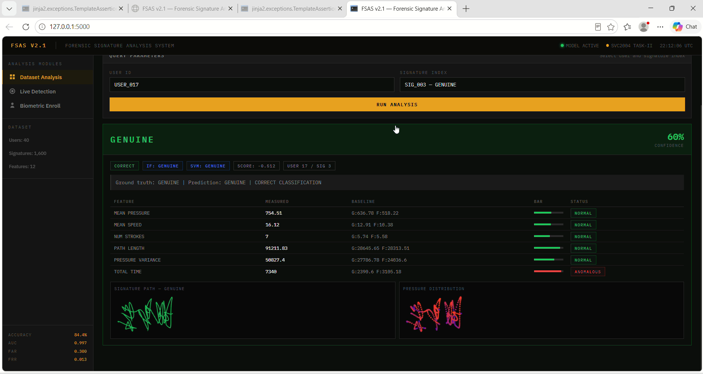

# FSAS V2.1 — Forensic Signature Authentication System

AI-Powered Online Signature Forgery Detection using behavioral biometrics.

## Results
- Accuracy: 84.38%
- AUC Score: 0.997
- False Rejection Rate: 1.25%
- Dataset: SVC2004 (1,600 signatures, 40 users)

## Tech Stack
- Python, Flask
- Scikit-learn (IsolationForest + OneClassSVM)
- HTML5 Canvas, JavaScript
- Pandas, NumPy, Matplotlib

## Features
- Module 1: Dataset Verification
- Module 2: Live Pattern Detection  
- Module 3: Personal Biometric Enrollment

## How it Works
Captures 12 behavioral features (pressure, speed,
stroke count etc.) and classifies signatures as
GENUINE, FORGED, or UNCERTAIN.

## Author
Sana Ashfaq Rahat  
BS Cyber Forensics & Security | Air University Islamabad

## Screenshots

## Demo
[Watch Demo Video](https://drive.google.com/file/d/1RkC16oQjcbu7o8OquzLxsi6sllVDheZ1/view?usp=sharing)
